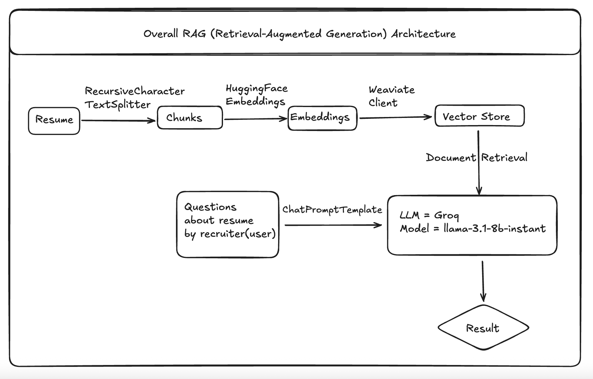

# 🧠 Resume Analyser — RAG Application

A Retrieval-Augmented Generation (RAG) based AI tool to intelligently analyze candidate resumes and answer recruiter questions in real time.

This application allows recruiters to ask natural-language questions about a candidate's resume and get insightful, accurate responses — powered by vector databases, sentence embeddings, and an LLM.

---

## 📸 Architecture Diagram

> Below is the architecture flow of how the system processes a resume and answers recruiter questions:



---

## 🎯 Goal of the Project

The main objective of this project is to **reduce recruiter overhead** by automating the process of understanding resumes. Instead of reading entire documents manually, recruiters can simply ask questions like:

- "What projects involve MongoDB?"
- "Does the candidate have certifications?"
- "What is the education background?"

This approach **saves time**, **improves accuracy**, and **streamlines recruitment workflows**.

---

## 🚀 Features

- ✅ Extracts and chunks resume content from PDF  
- ✅ Converts text chunks into vector embeddings  
- ✅ Stores vectors in Weaviate vector database  
- ✅ Allows question-answering via Groq-hosted LLaMA 3 model  
- ✅ Retrieval-Augmented Generation (RAG) pipeline with LangChain  

---

## 🛠 Tech Stack

| Tool                     | Purpose                                      |
|--------------------------|----------------------------------------------|
| **Python**               | Core language                                |
| **LangChain**            | RAG pipeline orchestration                   |
| **Weaviate**             | Vector store for semantic search             |
| **HuggingFace**          | Embedding model (`all-mpnet-base-v2`)        |
| **Groq**                 | LLM provider (LLaMA 3.1 8B Instant)          |
| **sentence-transformers**| Required for HuggingFaceEmbeddings           |
| **PyPDFLoader**          | Extracts raw text from PDF resumes           |
| **dotenv**               | Manages API keys via `.env` file             |

---

## 📂 Project Structure

```
Resume-Analyser__RAG-Application/
├── analyser.py                  # Main script for entire pipeline
├── .env                         # Contains secret API keys (not pushed)
├── .gitignore                   # Prevents secrets and system files from being committed
├── README.md                    # You're reading it!
├── Screenshot...png             # Architecture diagram
└── Resume Files/
    └── Harsh Padsala.pdf        # Sample input resume
```

---

## 🔑 Required Environment Variables

Create a `.env` file in the root directory with the following variables:

```env
WEAVIATE_URL=your_weaviate_instance_url
WEAVIATE_API_KEY=your_weaviate_api_key
GROQ_API_KEY=your_groq_api_key
```

---

## 🔁 RAG Pipeline Flow

1. **Resume Parsing**  
   - Loads and splits resume using `PyPDFLoader` + `RecursiveCharacterTextSplitter`.  

2. **Embeddings**  
   - Text chunks are converted into vector embeddings using HuggingFace's `all-mpnet-base-v2`.  

3. **Vector Store (Weaviate)**  
   - Embeddings are stored in Weaviate to enable semantic document retrieval.  

4. **Querying with LLM**  
   - User question is formatted using `ChatPromptTemplate`.  
   - Retrieved documents + question are passed to the LLaMA-3.1-8B model hosted via Groq.  
   - Response is generated and returned.  

---

## ⚙️ Setup Instructions

### 1. Clone the Repo

```bash
git clone https://github.com/Harshpadsala/Resume-Analyser__RAG-Application.git
cd Resume-Analyser__RAG-Application
```

### 2. Create Virtual Environment

```bash
python3 -m venv .venv
source .venv/bin/activate  # On Windows: .venv\Scripts\activate
```

### 3. Install Dependencies

```bash
pip install -r requirements.txt
```

Or manually:

```bash
pip install langchain langchain-community langchain-huggingface langchain-weaviate weaviate-client sentence-transformers langchain-groq python-dotenv
```

### 4. Add Your `.env`

```bash
# .env
WEAVIATE_URL=...
WEAVIATE_API_KEY=...
GROQ_API_KEY=...
```

### 5. Run the Script

```bash
python analyser.py
```

---

## 🧪 Sample Questions to Ask

- "Share all details of candidate"
- "Which project includes MongoDB?"
- "List the certifications completed"
- "What technologies does the candidate know?"

---

## 📌 .gitignore Example

```gitignore
.env
Resume Files/
__pycache__/
*.pyc
*.log
```

---

## 👤 Author

**Harsh Padsala**  
📧 harshpadsala265@gmail.com  
🔗 [github.com/Harshpadsala](https://github.com/Harshpadsala)

---
